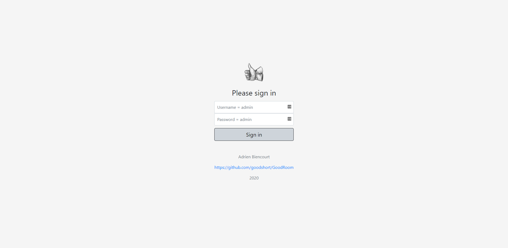
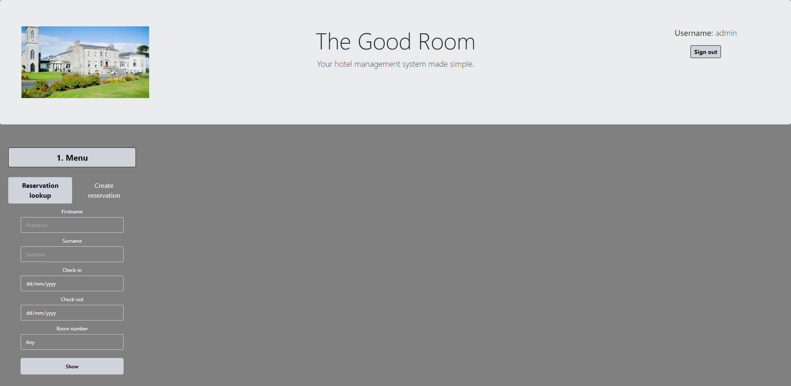

# GoodRoom
 Your hotel management system made simple

## What is it?
A web app project designed for the Web Application Development course of the Higher Diploma in Software Development studies at [GMIT](https://www.gmit.ie/).

### Screenshots




### Sign-in
You have to sign-in to access the homepage (credentials: admin/admin).
The sign-in feature is based on [session data](https://www.tutorialspoint.com/php/php_login_example.htm).

### Homepage
Once on the homepage, you have access to two features:
- Reservation Lookup:
Based on criterias entered, you can lookup the database to see bookings.
- Create reservation:
These features are directly retrieving/editing information on the database.

A few interesting points to note:
- A "sign out" is available at the top right of the page
- A carroussel of pictures is displayed on the top left
- The page is mobile friendly and will automatically scroll to the next step (i.e. `formaction='#profileList'`)


### Database
The database file is hand-written (I prefer it this way).
Crow's Feet outline of the database can be found [here](https://drive.google.com/file/d/1gpjsiuOmtnwyPhbj9pjXkhSb40zUBvJb/view?usp=sharing).
Please note that the database connections made within the PHP files assumes that you use the parameters below: (edit if necessary)
```
$dbhost = "localhost";
$dbuser = "root";
$dbpassword = "";
$dbname = "GoodRoom";
```

## How to use it?

### Prerequisites

You will need [XAMPP](https://www.apachefriends.org/index.html) to host this web app (or something similar).
The project uses these 2 modules:
- Apache
- MySQL

### Step by step deployment

1. Using XAMPP Control Panel, start Apache and MySQL modules

2. Navigate to the xampp\htdocs folder using terminal or CMD (i.e. `cd "C:\xampp\htdocs"`)

3. Clone this repository in the 
```
git clone https://github.com/goodshort/GoodRoom.git
```

4. Create the required database in phpMyAdmin
- Navigate to http://localhost/phpmyadmin/
- In the toolstrip at the top of the page > Click on "Import"
- Click on "Choose a file" and select the "GoodRoomDB.sql" file located in "C:\xampp\htdocs\GoodRoom\database\"
- Make sure that the import is successful

5. Navigate to http://localhost/GoodRoom/signin.php
You can now sign-in using the credentials:
- username: admin
- password: admin

## Issues / Comments
- Issue: Implement date time to be able to checkout and checkin on the same date and to fix the issue of room showing up in create reservation if selected dates are 1 night only
- Enhancement: Reservations made on roomType and not roomNo
- Enhancement: Add/Remove users from database
- Enhancement: Display a calendar with availability
- Enhancement: Use [{less}](http://lesscss.org/) for CSS

## License

This project is licensed under the MIT License - see the [LICENSE.md](LICENSE.md) file for details
